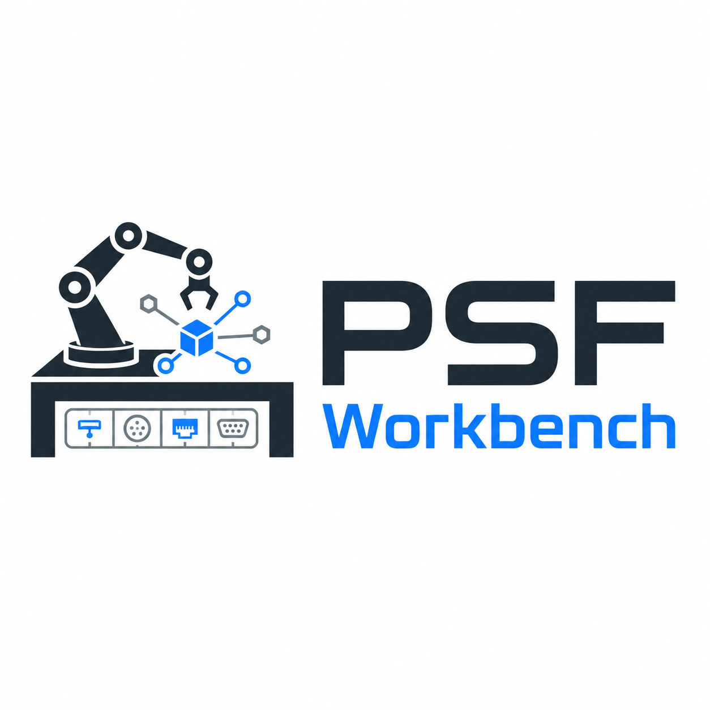

<p align="center">
  
</p>

<h1 align="center">PSF Workbench</h1>

<p align="center"><i>Robotics tooling, deployable.</i></p>

---

> Anything you'd have to set up by hand to use modern robotics tooling
> productively, Workbench sets up for you. The underlying software runs
> unchanged. The user's relationship with it changes.

PSF Workbench is a standalone robotics product whose job is to make
robotics tooling deployable and usable, so the end user can focus on
robotics instead of DevOps. Its first and deepest coverage is the
ROS 2 ecosystem (Gazebo, MoveIt, Nav2, ros2_control, vendor SDKs); the
architecture is designed to extend to MuJoCo, microcontroller endpoints
(ESP32, RP2040), and industrial protocols (PLC, Modbus, OPC-UA).

## Status — v0.2.0

What ships now:

| Component | Status |
|---|---|
| Architecture & design (`DESIGN.md`) | ✓ stable |
| `workbench` CLI | ✓ `run --mode play` dispatches via adapter |
| `intrinsic-aic` adapter pack | ✓ Play mode runs; Eval / Submit have documented manual fallbacks |
| Electron desktop UI | ✓ splash → chooser → onboarding wizard → operator view |
| **Behavior Deck editor** | ✓ compose policies as named cards with parameters |
| **Code editor (CodeMirror 6)** | ✓ in-app Python editor for `policy.py` with syntax highlighting, autocomplete, search, conflict-aware save |
| **Code generator** | ✓ deck.yaml → working `policy.py` derived from `aic_model.policy.Policy` |
| **Subprocess lifecycle** | ✓ clean SIGINT + `docker stop`, awaits real cleanup, sweeps orphan containers on startup |
| **Policy ↔ live sim auto-launch** | ✓ Play mode launches the project's policy container alongside the sim, so behavior is visible end-to-end |
| Eval mode managed by Workbench | — planned |
| Log Intelligence | — planned |
| Submission flow + fingerprints | — planned |
| Storage Manager | — planned |

The dev loop today: open the project in the Workbench desktop app,
compose a policy by adding behavior cards (Approach, Descend, Wiggle,
Spiral search, Back off, Insert), tweak parameters, click "Save &
Generate code". Workbench writes `deck.yaml` and `policy.py` into your
project. Click "Run Play mode" — Gazebo opens; the simulator is alive
without the AIC evaluator (no scoring pressure, no fixed trial schedule).

## Why this exists

The core thesis is in [`DESIGN.md`](DESIGN.md). In short:

Modern robotics is blocked less by raw capability than by integration
complexity. The capability has been there for years. The blocker is
the cost of going from "interesting tech" to "running on Tuesday
afternoon at Bob's Machine Shop in Cleveland." Workbench reduces that
cost by wrapping robotics tooling — never replacing it — so domain
experts can focus on the actual machine.

## Try it (very early)

There are two ways to drive Workbench: the desktop UI (intended for
day-to-day work) and the `workbench` CLI (intended for headless runs,
scripting, and CI). Both call into the same adapter scripts under the
hood, so behavior is identical — only the surface differs.

### Desktop UI — `./start.sh`

```bash
# 1. Clone this repo somewhere.
git clone https://github.com/hfsc2004/workbench.git ~/Workbench

# 2. Bootstrap once (installs Node 20+, Electron, UI deps):
cd ~/Workbench
./RUN_ONCE.sh

# 3. Launch the desktop app:
./start.sh
```

`./start.sh` is the entry point for the desktop app. It runs the Electron
launcher (`workbench-ui`) that `RUN_ONCE.sh` generates; if you haven't
bootstrapped yet it'll tell you and exit cleanly. Both `RUN_ONCE.sh` and
`start.sh` are idempotent — re-run them any time. They target
Debian/Ubuntu hosts for now; macOS and Windows packaging come later.

Once the UI is up:

1. The splash screen offers a recent-session list. Pick the project
   directory you want to work in (it must contain a
   `workbench.project.yaml`).
2. The operator view has a **Code** tab for editing your `policy.py`
   in-window, a **Deck** tab for composing a policy from named cards,
   and a **Run** panel.
3. Click **Run Play mode** to launch the simulation. Output streams
   live in the UI; clicking Stop sends SIGINT to the run and waits for
   containers to clean up.

### CLI — `./workbench`

```bash
# 1. Clone the repo (as above). RUN_ONCE.sh is NOT required for CLI use —
#    the CLI is a self-contained bash script with no Node/Electron deps.

# 2. From a project directory (one containing workbench.project.yaml):
cd ~/projects/my-aic-project
~/Workbench/workbench run --mode play
```

The project file declares which adapter the project uses and what
configuration it should pass through. The CLI walks up from the current
directory looking for `workbench.project.yaml`, so as long as your shell
is somewhere inside the project tree it'll find it.

#### Verbs implemented today

| Verb | What it does |
|---|---|
| `workbench run --mode play` | Launch the project's adapter in Play mode. For `intrinsic-aic`, that means sim + controllers + task board + cable on gripper, and (in v0.2+) the project's policy container running alongside, so behavior is visible in Gazebo. |
| `workbench run --mode eval` | Adapter-defined. The `intrinsic-aic` adapter currently documents a manual fallback (run upstream `docker compose` directly). |
| `workbench run --mode submit` | Adapter-defined. Same fallback note as `eval` for `intrinsic-aic`. |
| `workbench help` | Print verbs and the list of installed adapters. |

#### Project file shape

A minimal `workbench.project.yaml` looks like:

```yaml
adapter: intrinsic-aic        # which adapter pack drives this project
adapter_config:
  aic_ws: /path/to/ws_aic     # required for intrinsic-aic
  gui: true
  rviz: true
  ground_truth: false
  cable_type: sfp_sc_cable
```

See [`adapters/intrinsic-aic/adapter.yaml`](adapters/intrinsic-aic/adapter.yaml)
for the full list of keys the AIC adapter understands and what each one
does.

#### Stopping a CLI run

`Ctrl-C` in the terminal sends SIGINT; the adapter's launch script
installs a trap that stops every container it created. Workbench also
sweeps any stranded `workbench-aic-*` containers on startup of the next
run, in case a previous session crashed.

## Design rules

The load-bearing rules from [`DESIGN.md`](DESIGN.md). Every PR is reviewed
against them.

1. **Wrap, never replace.** Workbench does not reimplement what
   existing robotics tooling already does well.
2. **Workbench owns the verbs the user actually presses.** Adapters
   provide the nouns.
3. **Emit, don't hide.** Generated artifacts land on disk in the
   user's project, readable and editable. No magical hidden state.
4. **Every run gets a fingerprint.** Reproducibility is the industrial
   trust layer.
5. **Logs become human status.** Workbench's log handling is a
   contextual interpreter, not a filter.
6. **Workbench owns storage layout.** When the user says "use the big
   drive," every tool's data root goes there. Migration is never silent.
7. **No telemetry by default.** Local-first means local-first.
8. **Secrets never leave the secrets store.** Never written to
   fingerprints, generated artifacts, logs, telemetry, or audit records.
9. **Engines never own actuation.** Every engine output passes through
   a deterministic safety gate.

## Repository layout

```
Workbench/
├── workbench                    the CLI (bash)
├── start.sh                     entry point for the desktop UI
├── workbench-ui                 generated Electron launcher (built by RUN_ONCE.sh)
├── RUN_ONCE.sh                  idempotent bootstrap (Node + Electron + UI deps)
├── DESIGN.md                    architecture, build order, success criteria
├── README.md                    this file
├── LICENSE                      Apache 2.0
├── adapters/
│   └── intrinsic-aic/           the AIC adapter pack
│       ├── adapter.yaml
│       └── play.sh
└── ui/                          Electron desktop app
    ├── package.json
    ├── main.js                  Electron main process
    ├── preload.js               contextBridge surface
    ├── renderer/                splash, chooser, onboarding pages
    └── assets/
        └── logo.png
```

## License

Apache 2.0. See [`LICENSE`](LICENSE).

---

Copyright 2026 Pseudo Science Fiction
